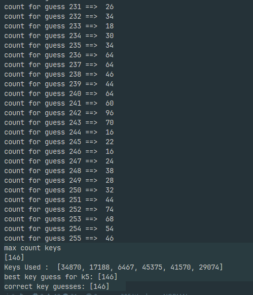

# Differential Attack on Sypher004

## Overview
This directory contains a differential attack on the Sypher004 block cipher to find eight subkey bits in the last round. 

## Contents
- `analyze.py`: Contains functions to analyze paths and calculate probabilities for differential characteristics.
- `attack.py`: Implements the differential attack strategy to recover the subkeys.
- `sypher004.py`: The implementation of the Sypher004 cipher.
- `utils.py`: Utility functions for generating message pairs, random keys, and applying permutations.

## Key Concepts
### Differential Attack
The attack targets the last round of the Sypher004 by following a defined path through the cipher's rounds. The key points of the strategy are:
- A specific path is chosen that connects inputs and outputs through the S-boxes.
- The probability of the differential characteristic is calculated based on the number of valid transitions in the chosen path.

### Probability Calculation
The total probability for the chosen differential path is given as:
$\left(\frac{6}{14}\right)^6 \approx 0.0027$
This value indicates the likelihood of correctly guessing the key based on the differential properties exploited.

## Steps to Execute the Attack
1. **Generate Message Pairs**: Use the `generate_message_pairs` function to create \(2^{16}\) message pairs with the specified differences.
2. **Filter Messages**: The `filter_message` function reduces the number of message pairs, typically resulting in around 7200 pairs.
3. **Key Guessing**: Iterate through possible keys (from \(0x0110\) to \(0x0FF0\)) for \(k5\), maintaining a counter for matches.
4. **Reverse Outputs**: For each pair, retrieve ciphertexts and reverse the last round to obtain the fourth-round outputs.
5. **Check Output Differences**: Verify that the output differences match the expected difference \((out_1 \oplus out_2) = 0x0220\).
6. **Find Best Key Candidates**: Identify keys with the highest match counts and validate against actual key values.

## Automated Execution
```bash
python attack.py
```

## Output


